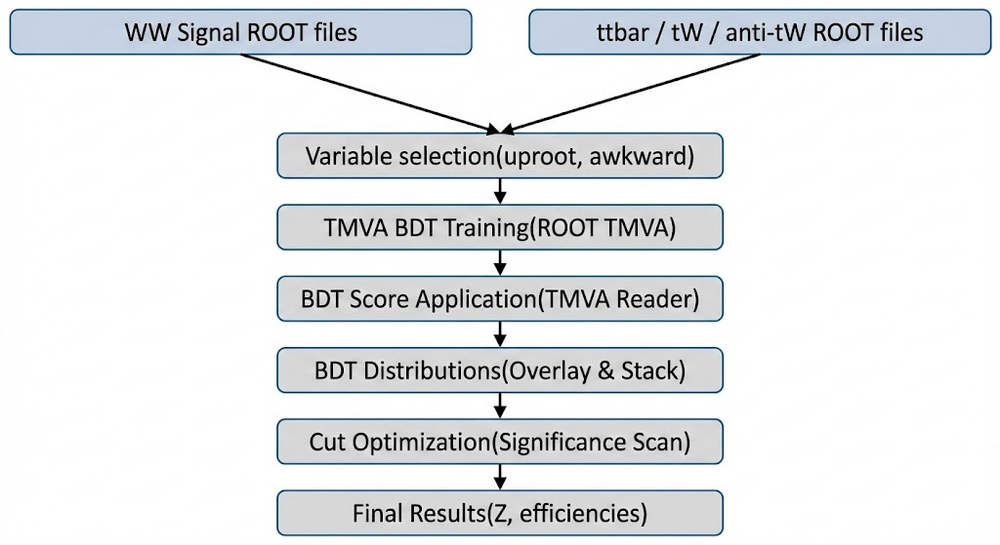

# WW-BDT-TMVA
Multivariate BDT analysis for WW signal vs top backgrounds using ROOT TMVA

# WW Signal vs Top Background Discrimination using BDT (TMVA)

This repository contains a multivariate analysis using Boosted Decision Trees (BDTs)
to separate WW signal events from dominant top-quark backgrounds using the ROOT TMVA framework.

## 🔬 Analysis Overview
- Framework: ROOT TMVA  
- Classifier: Gradient Boosted Decision Tree (BDT)  
- Signal: WW  
- Backgrounds: ttbar, tW, t̄W  
- Final observable: BDT score  

## 📊 Input Variables
The BDT is trained using kinematic and event-level observables motivated by the
physics of WW and top-quark production:

- Lepton transverse momenta (pt1, pt2)
- Lepton pseudorapidities (η1, η2)
- Dilepton invariant mass (mll)
- Dilepton transverse momentum (ptll)
- Δφ between leptons
- Missing transverse energy (MET)
- Transverse masses (mtw1, mtw2)
- Jet multiplicity (nJet)
- b-jet multiplicity (nBJet)

## 🧠 Training
The BDT is trained using TMVA with the following configuration:

- NTrees = 600  
- MaxDepth = 3  
- BoostType = Grad  
- UseBaggedBoost = True  

The training follows standard TMVA practices and includes validation using
ROC curves and overtraining checks.

## 📈 Results
- Optimal BDT cut: **0.66**
- Signal efficiency: **~68%**
- Background efficiency: **~4.9%**
- Strong separation between signal and background observed

The classifier performance is evaluated using BDT output distributions,
ROC curves, and overtraining checks.

## Data Availability

The ROOT (`.root`) files used in this analysis are **not included** in the repository
due to their large size and standard data management practices in High Energy Physics.

The repository contains:
- All analysis and plotting scripts
- TMVA configuration and trained BDT setup
- Final plots used in the report
- Full written report (PDF and LaTeX source)

The analysis can be reproduced by running the provided scripts on locally
available ROOT files with the same tree structure and variable definitions.

Additional details on data format and requirements are provided in [`DATA.md`](DATA.md).

## 📂 Repository Structure

WW-BDT-TMVA/
├── DATA.md
├── README.md
├── docs
│   └── analysis_flow.png
├── plots
│   ├── BDT_signal_vs_background.png
│   ├── BDT_stack.png
│   ├── input_variable
│   │   ├── input_variable_part1.png
│   │   └── input_variable_part2.png
│   ├── linear_correlation_coefficients
│   │   ├── correlationmatrix_background.png
│   │   └── correlationmatrix_signal.png
│   ├── overtraining
│   │   └── overtraining_check_bdt.png
│   ├── roc
│   │   └── roc_bdt.png
│   └── significance_vs_cut.png
├── report
│   ├── WW_BDT_Report.pdf
│   └── WW_BDT_Report.tex
└── scripts
    ├── step_1
    │   └── root_reduction.py
    ├── step_2
    │   └── variable_calculation.py
    ├── step_3
    │   └── train_tmva_bdt.py
    ├── step_4
    │   └── tmva_bdt.py
    ├── step_5
    │   └── plot_bdt_overlay.c
    ├── step_6
    │   └── plot_bdt_stack.c
    └── step_7
        └── plot_significance.c

## 🔄 Analysis Workflow

  

This figure summarizes the complete analysis pipeline used in this project:
starting from Monte Carlo samples, feature selection and preprocessing,
TMVA-based BDT training, application of the trained classifier to signal and
background samples, and final optimization using the BDT score.

The output of the BDT classifier and its performance are shown in the `plots/`
directory, including the BDT score distribution, background composition stack,
and efficiency-based optimization curves.

## 🚀 How to Run

1. Train the BDT:
python train_tmva_bdt.py

2. Apply the trained BDT:
python tmva_bdt.py

3. Generate plots using ROOT macros provided in the scripts/ directory.

📌 Notes
ROOT input files are not included due to size constraints.

The analysis focuses on efficiencies rather than absolute signal significance.

Intended for educational and research demonstration purposes.

Author: Manan Makhija
Tools: ROOT, TMVA, Python, uproot